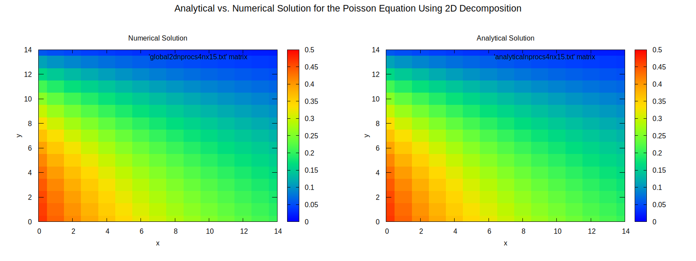
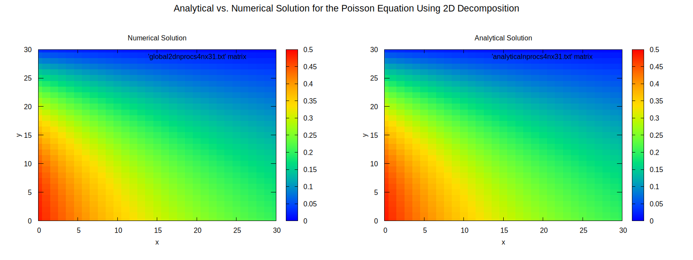

# High-Performance Computing Software II <!-- omit from toc -->

## Assignment 1 - 2D Processor Decomposition Poisson Solver <!-- omit from toc -->

- [Mathematical Background](#mathematical-background)
- [Folder Structure and Usage Details](#folder-structure-and-usage-details)
  - [1D Implementation](#1d-implementation)
  - [1D Implementation](#1d-implementation-1)
- [How to Run](#how-to-run)
  - [1D Implementation](#1d-implementation-2)
  - [2D Implementation](#2d-implementation)
- [Results](#results)
  - [Question 2](#question-2)
  - [Question 3](#question-3)
  - [Question 4](#question-4)

### Mathematical Background

This project implements a parallel solver for the 2D Poisson equation using the finite difference method. The Poisson equation is a partial differential equation of the form

```math
\nabla^2u(x,y)=\frac{\partial^2u(x,y)}{\partial x^2}+\frac{\partial^2u(x,y)}{\partial y^2}=f(x,y),\quad0\leq x,y \leq 1.
```

We solve this equation on the region $\Omega=[0,1]\times[0,1]$ on $\partial\Omega$ (i.e., Dirichlet boundary conditions).

The implementation uses the Jacobi iterative method to solve the discrete form of this equation on a uniform grid, distributing the computation across multiple processors using MPI. Two domain decomposition approaches are implemented:

- **1D Decomposition**: The domain is divided into column-wise strips, with each processor handling a set of adjacent columns.
- **2D Decomposition**: The domain is divided into rectangular blocks, with each processor handling a two-dimensional portion of the grid.

### Folder Structure and Usage Details

The repository is organised to address the requirements of the assignment with separate directories for 1D and 2D implementations.

#### 1D Implementation

Located in `1d`, where this folder contains the C code required for the assignment, addressing the first, second, and third question. It is organised as follows:

- `src/main.c`: The main driver programme implementing the 1D parallel Poisson solver.
- `src/aux.c`: Utility functions for grid initialisation.
- `src/jacobi.c`: Implementation of the Jacobi iteration method, including ghost cell exchange.
- `src/gatherwrite.c`: Functions for gathering distributed grid data and writing output.
- `src/decomp1d.c`: Domain decomposition utilities for dividing the grid among processors.
- `include/`: Header files defining function prototypes and constants.
- `scripts/heatmap.gp`: Script for generating heatmap visualisations.
- `Makefile`: Automates the compilation process. See [here](#how-to-run) for details on how to compile and run.

#### 1D Implementation

Located in `2d`, where this folder contains the C code required for the assignment, addressing the fourth question. It is organised as follows:

- `src/main.c`: The main driver programme implementing the 2D parallel Poisson solver.
- `src/aux.c`: Utility functions for grid initialisation.
- `src/jacobi.c`: Implementation of the Jacobi iteration method, including functions for ghost cell exchange in two directions.
- `src/gatherwrite.c`: Functions for gathering distributed 2D grid data and writing output.
- `src/decomp2d.c`: Two-dimensional domain decomposition utilities for dividing the grid among processors.
- `include/`: Header files defining function prototypes and constants.
- `scripts/heatmap.gp`: Script for generating heatmap visualisations.
- `Makefile`: Automates the compilation process. See [here](#how-to-run) for details on how to compile and run.

### How to Run

#### 1D Implementation

1. **Compilation**: Navigate to the `1d` folder and run:

    ```bash
    make
    ```

    This will compile the source files and generate the executable `bin/poiss1d`.

2. **Execution**: To run the solver with four processors (and a grid size of `nx = 31`):

    ```bash
    make run
    ```

    Also, it can be ran manually, where the user can specify a grid size themselves. Please note, however, that `include/poisson1d.h` contains `#define maxn 31 + 2` which means that grids, regardless of what grid size is specified when ran, will be initialised to have `maxn` rows and columns. To change this, change `31` to the required grid size (e.g., `15`), run `make clean`, compile once more as before, and ensure to include the specified grid size in the run command (i.e., `mpirun -np 4 bin/poiss1d 15`) since it defaults to `31` if a grid size is not specified. Thus, to run manually, using a grid size of `15` and four processors, run the following (after having made the necessary changes to `header/poisson1d.h`):

    ```bash
    mpirun -np 4 bin/poiss1d 15
    ```

3. **Visualisation**: After running the solver (e.g., using `nprocs = 4` and `nx = 31`), generate a heatmap of the solution:

    ```bash
    make heatmap
    ```

    This will generate a file called `heatmapnprocs4nx31.png`.

    > It is important to note that `global1dnprocs4nx31.txt` and `analyticalnprocs4nx31.txt` (the gathered global grid for a grid size of `nx = 31` using `nprocs = 4` processors and analytical solution for the same parameters) are hardcoded into the plotting function (i.e., `scripts/heatmap.gp`), as are the lengths of the $x$- and $y$-axes. To generate a heatmap for a different grid size, please change `global1dnprocs4nx31.txt` and `analyticalnprocs4nx31.txt` to the respective files (e.g., `global1dnprocs4nx15.txt` and `analyticalnprocs4nx15.txt`), and don't forget the $x$ and $y$ values too. Also, for consistency, change the title too (i.e., `heatmapnprocs4nx15.png`, for the previous example).

4. **Cleaning**: To remove all compiled files and output:

    ```bash
    make clean
    ```

#### 2D Implementation

1. **Compilation**: Navigate to the `2d` folder and run:

    ```bash
    make
    ```

    This will compile the source files and generate the executable `bin/poiss2d`.

2. **Execution**: To run the solver with four processors (and a grid size of `nx = 31`):

    ```bash
    make run4
    ```

    Also, it can be ran manually, where the user can specify a grid size themselves. Please note, however, that `include/poisson2d.h` contains `#define maxn 31 + 2` which means that grids, regardless of what grid size is specified when ran, will be initialised to have `maxn` rows and columns. To change this, change `31` to the required grid size (e.g., `15`), run `make clean`, compile once more as before, and ensure to include the specified grid size in the run command (i.e., `mpirun -np 4 bin/poiss2d 15`) since it defaults to `31` if a grid size is not specified. Thus, to run manually, using a grid size of `15` and four processors, run the following (after having made the necessary changes to `header/poisson2d.h`):

    ```bash
    mpirun -np 4 bin/poiss2d 15
    ```

    Moreover, there is an option to run with 16 processors (and a grid size of `nx = 31`):
    
    ```bash
    make run16
    ```

3. **Visualisation**: After running the solver, generate a heatmap of the solution:

    ```bash
    make heatmap
    ```

    This will generate a file called `heatmapnprocs4nx31.png`.

    > It is important to note that `global2dnprocs4nx31.txt` and `analyticalnprocs4nx31.txt` (the gathered global grid for a grid size of `nx = 31` using `nprocs = 4` processors and analytical solution for the same parameters) are hardcoded into the plotting function (i.e., `scripts/heatmap.gp`), as are the lengths of the $x$- and $y$-axes. To generate a heatmap for a different grid size, please change `global2dnprocs4nx31.txt` and `analyticalnprocs4nx31.txt` to the respective files (e.g., `global2dnprocs4nx15.txt` and `analyticalnprocs4nx15.txt`), and don't forget the $x$ and $y$ values too. Also, for consistency, change the title too (i.e., `heatmapnprocs4nx15.png`, for the previous example).

4. **Cleaning**: To remove all compiled files and output:

    ```bash
    make clean
    ```

### Results

#### Question 2

We obtain the following output after running with `nprocs = 4` and `nx = 15`:

```bash
=======================================================
                   1D Implementation                   
=======================================================

Solving the Poisson equation on a 15 x 15 grid with 4 processors

Layout of our grid
Process  0: Coords = (0) | Domain = (cols  1 to  4) | Neighbours = (L: -1, R:  1)
Process  1: Coords = (1) | Domain = (cols  5 to  8) | Neighbours = (L:  0, R:  2)
Process  2: Coords = (2) | Domain = (cols  9 to 12) | Neighbours = (L:  1, R:  3)
Process  3: Coords = (3) | Domain = (cols 13 to 15) | Neighbours = (L:  2, R: -1)

Starting iterative solver
Iteration    0: Global difference = 8.418388e-02
Iteration  100: Global difference = 1.002473e-06
Iteration  200: Global difference = 4.272124e-10
Iteration  249: Global difference = 9.530944e-12

Converged after 250 iterations
Solver completed in 0.038805 seconds

All processes have written their local grids to files

Gathering solution from all processes
Gathering complete

Writing final solution to files

Error analysis
Maximum error: 1.28271503e-04
Average error: 5.23477225e-05

=======================================================
                        SUCCESS                        
=======================================================
```

Note how small our maximum error is between the analytical and numerical solution, thus demonstrating how closely the finite difference solution matches the analytic solution. In the same spirit, here is the output after running with `nprocs = 4` and `nx = 31`:

```bash
=======================================================
                   1D Implementation                   
=======================================================

Solving the Poisson equation on a 31 x 31 grid with 4 processors

Layout of our grid
Process  0: Coords = (0) | Domain = (cols  1 to  8) | Neighbours = (L: -1, R:  1)
Process  1: Coords = (1) | Domain = (cols  9 to 16) | Neighbours = (L:  0, R:  2)
Process  2: Coords = (2) | Domain = (cols 17 to 24) | Neighbours = (L:  1, R:  3)
Process  3: Coords = (3) | Domain = (cols 25 to 31) | Neighbours = (L:  2, R: -1)

Starting iterative solver
Iteration    0: Global difference = 1.689830e-01
Iteration  100: Global difference = 9.665088e-05
Iteration  200: Global difference = 1.297251e-05
Iteration  300: Global difference = 1.873463e-06
Iteration  400: Global difference = 2.716588e-07
Iteration  500: Global difference = 3.940026e-08
Iteration  600: Global difference = 5.714519e-09
Iteration  700: Global difference = 8.288206e-10
Iteration  800: Global difference = 1.202102e-10
Iteration  900: Global difference = 1.743501e-11
Iteration  929: Global difference = 9.959825e-12

Converged after 930 iterations
Solver completed in 0.035195 seconds

All processes have written their local grids to files

Gathering solution from all processes
Gathering complete

Writing final solution to files

Error analysis
Maximum error: 1.50493569e-05
Average error: 6.15113126e-06

=======================================================
                        SUCCESS                        
=======================================================
```

Once again, the maximum error is small.

#### Question 3

See `1d/global1dnprocs4nx31.txt` and compare it to `1d/analyticalnprocs4nx31.txt` to see how close the numerical solution matches the analytical one. The heatmap shows this similarity visually:


#### Question 4

We obtain the following output after running with `nprocs = 4` and `nx = 15`:

```bash
=======================================================
                   2D Implementation                   
=======================================================

Solving the Poisson equation on a 15 x 15 grid with 4 processors

Layout of our grid
Process  0: Coords = (0, 0) | Domain = (rows  8 to 15, cols  1 to  8) | Neighbours = (U: -1, D:  2, L: -1, R:  1)
Process  1: Coords = (0, 1) | Domain = (rows  8 to 15, cols  9 to 15) | Neighbours = (U: -1, D:  3, L:  0, R: -1)
Process  2: Coords = (1, 0) | Domain = (rows  1 to  7, cols  1 to  8) | Neighbours = (U:  0, D: -1, L: -1, R:  3)
Process  3: Coords = (1, 1) | Domain = (rows  1 to  7, cols  9 to 15) | Neighbours = (U:  1, D: -1, L:  2, R: -1)

Starting iterative solver
Iteration    0: Global difference = 8.418388e-02
Iteration  100: Global difference = 1.002473e-06
Iteration  200: Global difference = 4.272124e-10
Iteration  249: Global difference = 9.530944e-12

Converged after 250 iterations
Solver completed in 0.024491 seconds

All processes have written their local grids to files

Gathering solution from all processes
Gathering complete

Writing final solution to files

Error analysis
Maximum error: 1.28271503e-04
Average error: 5.23477225e-05

=======================================================
                        SUCCESS                        
=======================================================
```

We obtain the following output after running with `nprocs = 4` and `nx = 31`:

```bash
=======================================================
                   2D Implementation                   
=======================================================

Solving the Poisson equation on a 31 x 31 grid with 4 processors

Layout of our grid
Process  0: Coords = (0, 0) | Domain = (rows 16 to 31, cols  1 to 16) | Neighbours = (U: -1, D:  2, L: -1, R:  1)
Process  1: Coords = (0, 1) | Domain = (rows 16 to 31, cols 17 to 31) | Neighbours = (U: -1, D:  3, L:  0, R: -1)
Process  2: Coords = (1, 0) | Domain = (rows  1 to 15, cols  1 to 16) | Neighbours = (U:  0, D: -1, L: -1, R:  3)
Process  3: Coords = (1, 1) | Domain = (rows  1 to 15, cols 17 to 31) | Neighbours = (U:  1, D: -1, L:  2, R: -1)

Starting iterative solver
Iteration    0: Global difference = 1.689830e-01
Iteration  100: Global difference = 9.665088e-05
Iteration  200: Global difference = 1.297251e-05
Iteration  300: Global difference = 1.873463e-06
Iteration  400: Global difference = 2.716588e-07
Iteration  500: Global difference = 3.940026e-08
Iteration  600: Global difference = 5.714519e-09
Iteration  700: Global difference = 8.288206e-10
Iteration  800: Global difference = 1.202102e-10
Iteration  900: Global difference = 1.743501e-11
Iteration  929: Global difference = 9.959825e-12

Converged after 930 iterations
Solver completed in 0.026052 seconds

All processes have written their local grids to files

Gathering solution from all processes
Gathering complete

Writing final solution to files

Error analysis
Maximum error: 1.50493569e-05
Average error: 6.15113126e-06

=======================================================
                        SUCCESS                        
=======================================================
```

We obtain the following output after running with `nprocs = 16` and `nx = 31`:

```bash
=======================================================
                   2D Implementation                   
=======================================================

Solving the Poisson equation on a 31 x 31 grid with 16 processors

Layout of our grid
Process  0: Coords = (0, 0) | Domain = (rows 24 to 31, cols  1 to  8) | Neighbours = (U: -1, D:  4, L: -1, R:  1)
Process  1: Coords = (0, 1) | Domain = (rows 24 to 31, cols  9 to 16) | Neighbours = (U: -1, D:  5, L:  0, R:  2)
Process  2: Coords = (0, 2) | Domain = (rows 24 to 31, cols 17 to 24) | Neighbours = (U: -1, D:  6, L:  1, R:  3)
Process  3: Coords = (0, 3) | Domain = (rows 24 to 31, cols 25 to 31) | Neighbours = (U: -1, D:  7, L:  2, R: -1)
Process  4: Coords = (1, 0) | Domain = (rows 16 to 23, cols  1 to  8) | Neighbours = (U:  0, D:  8, L: -1, R:  5)
Process  5: Coords = (1, 1) | Domain = (rows 16 to 23, cols  9 to 16) | Neighbours = (U:  1, D:  9, L:  4, R:  6)
Process  6: Coords = (1, 2) | Domain = (rows 16 to 23, cols 17 to 24) | Neighbours = (U:  2, D: 10, L:  5, R:  7)
Process  7: Coords = (1, 3) | Domain = (rows 16 to 23, cols 25 to 31) | Neighbours = (U:  3, D: 11, L:  6, R: -1)
Process  8: Coords = (2, 0) | Domain = (rows  8 to 15, cols  1 to  8) | Neighbours = (U:  4, D: 12, L: -1, R:  9)
Process  9: Coords = (2, 1) | Domain = (rows  8 to 15, cols  9 to 16) | Neighbours = (U:  5, D: 13, L:  8, R: 10)
Process 10: Coords = (2, 2) | Domain = (rows  8 to 15, cols 17 to 24) | Neighbours = (U:  6, D: 14, L:  9, R: 11)
Process 11: Coords = (2, 3) | Domain = (rows  8 to 15, cols 25 to 31) | Neighbours = (U:  7, D: 15, L: 10, R: -1)
Process 12: Coords = (3, 0) | Domain = (rows  1 to  7, cols  1 to  8) | Neighbours = (U:  8, D: -1, L: -1, R: 13)
Process 13: Coords = (3, 1) | Domain = (rows  1 to  7, cols  9 to 16) | Neighbours = (U:  9, D: -1, L: 12, R: 14)
Process 14: Coords = (3, 2) | Domain = (rows  1 to  7, cols 17 to 24) | Neighbours = (U: 10, D: -1, L: 13, R: 15)
Process 15: Coords = (3, 3) | Domain = (rows  1 to  7, cols 25 to 31) | Neighbours = (U: 11, D: -1, L: 14, R: -1)

Starting iterative solver
Iteration    0: Global difference = 1.689830e-01
Iteration  100: Global difference = 9.665088e-05
Iteration  200: Global difference = 1.297251e-05
Iteration  300: Global difference = 1.873463e-06
Iteration  400: Global difference = 2.716588e-07
Iteration  500: Global difference = 3.940026e-08
Iteration  600: Global difference = 5.714519e-09
Iteration  700: Global difference = 8.288206e-10
Iteration  800: Global difference = 1.202102e-10
Iteration  900: Global difference = 1.743501e-11
Iteration  929: Global difference = 9.959825e-12

Converged after 930 iterations
Solver completed in 0.085384 seconds

All processes have written their local grids to files

Gathering solution from all processes
Gathering complete

Writing final solution to files

Error analysis
Maximum error: 1.50493569e-05
Average error: 6.15113126e-06

=======================================================
                        SUCCESS                        
=======================================================
```

See `2d/global2dnprocs4nx15.txt` and compare it to `2d/analyticalnprocs4nx15.txt` to see how close the numerical solution matches the analytical one. The heatmap shows this similarity visually:



See `2d/global2dnprocs4nx31.txt` and compare it to `2d/analyticalnprocs4nx31.txt` to see how close the numerical solution matches the analytical one. The heatmap shows this similarity visually:


